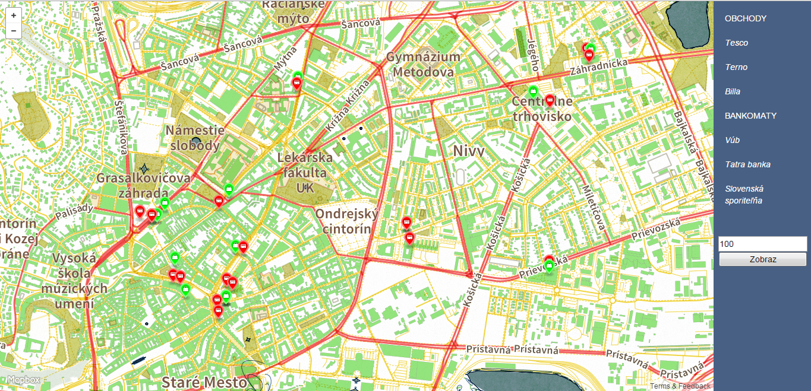

#Prehľad
Aplikácia ukazuje obchody s potravinami v Bratislave všeobecne, ale aj najznámejšie značky ako Billa, Tesco, Terno. Rovnako sa zobrazujú všetky bankomaty všeobecne, ale aj podľa bánk ako napr. Tatra banka, VÚB, Slovenská sporiteľňa. 
Používateľ má možnosť určiť maximálnu vzdialenosť a zobrazia sa mu dvojice obchod a bankomat, ktoré sú od seba vzdialené menej alebo rovnako ako zadaná hodnota. 
Bankomaty sú od obchodov odlíšené farebne.

Screen ako vyzerá aplikácia v nasadení

Aplikácia pozostáva z frontend časti vo forme webovej aplikácie používajúca rozhranie mapboxu (mapbox.js). Backend časť je písaná v jazyku C#. Frontend s backendom komunikujú cez REST rozhranie.

#Frontend
Statická stránka zložená z mapky a sidebaru. Mapa je zobrazovaná prostredníctvom upraveného mapbox štýlu (pôvodný Pirates Return). Upravené je farebná pestrosť, cesty sú odškálované na viacero farieb podľa triedy, zmenený font a vykresľovanie vody a vodných plôch. Na pravej strane je sidebar pomocou ktorého si možno zobraziť všetky obchody(celkovo alebo po značkách), všetky bankomaty(celkovo alebo po bankách) a stanoviť si maximálnu dĺžku a zobraziť obchod s bankomat v tejto vzdialenosti.

#Backend
Implementované v C#, spracovanie dopytov, spracovanie GeoJson. V zložke models je uložený zoznam GeoJson-ov, koordináty a taktiež vlastnosti. V zložke Controllers je HomeController.cs, v ktorom sú jednotlivé dopyty z databáze.

#Dáta
Dátové informácie sú z Open Street Maps. Stiahnutý file má okolo 150MB a mapuje celú Bratislavu(bez priľahlých obcí). 
Dáta sú naimportované pomocou osm2pgsql do bežnej schémy (planet_osm_polygon/point/line...) vo formáte WGS84 s parametrom hstore. 
Nejedná sa o objemnú zložku takže dopyty sú rýchle a bezproblémové. 

